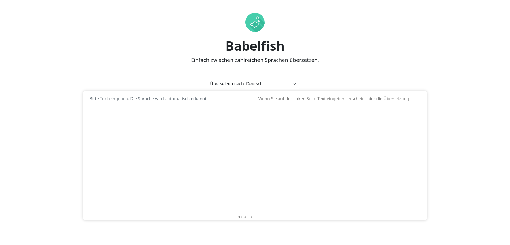

# Babelfish



Babelfish ist eine cloud-native Anwendung zur Übersetzung von Text in 82 verschiedenen Sprachen und orientiert sich an bereits existierenden Anwendungen (z.B. Google Translator, DeepL). Die Anwendung basiert auf mehreren Microservices, die auf Kubernetes betrieben werden.

Die Babelfish-Applikation besteht aus einem Frontend und einem Backend, die unabhängig voneinander in je einem eigenen Pod betrieben werden. Das Ziel dieser Aufteilung bestand darin, Frontend und Backend unabhängig voneinander skalieren zu können. Das Frontend wird von Nginx ausgeliefert, welches viele 100 Anfragen pro Sekunde beantworten kann. Das neuronale Netz im Backend kann dagegen nur zwischen 0,25 und zwei Anfragen pro Sekunde bearbeiten.

## Aufbau des Repositorys

### Frontend

Das Frontend besteht aus einer statischen Website, die von Nginx ausgeliefert wird. Der eingegebene Text wird in Echtzeit übersetzt.

Hierzu wird der Text in Sätze aufgeteilt, die unabhängig voneinander zur Übersetzung an das Backend geschickt werden. Hierdurch kann der erste Satz bereits übersetzt werden, während der Anwender noch den zweiten Satz eintippt. Außerdem kann der Load Balancer die Arbeitslast bei vielen kleinen Anfragen (einzelne Sätze) gleichmäßiger auf die verfügbaren Pods verteilen als bei wenigen großen (ganzer Text).

Um serverseitig Ressourcen zu sparen, werden die bereits übersetzten Sätze clientseitig gecacht. Dies ist beispielsweise hilfreich, wenn ein Nutzer eine Änderung vornimmt, die er gleich darauf wieder rückgängig macht. Der betroffene Satz muss dann nicht erneut übersetzt werden und dem Nutzer kann sofort die richtige Übersetzung aus dem Cache angezeigt werden.

### Backend

Das Backend ist in Python geschrieben und nutzt das FastAPI-Framework. Die Übersetzung wird von Hugging Face und Transformers in Kombination mit dem [Helsinki-NLP/opus-mt-ine-ine](https://huggingface.co/Helsinki-NLP/opus-mt-ine-ine) Modell durchgeführt. [Helsinki-NLP/opus-mt-ine-ine](https://huggingface.co/Helsinki-NLP/opus-mt-ine-ine) ist neben der [facebook/m2m100-Familie](https://huggingface.co/facebook/m2m100_418M) das einzige funktionierende und auf Huggingface verfügbare Modell, dass alle geforderten fünf Sprachen unterstützt. Facebooks / Metas Modelle erzielen zwar bessere Ergebnisse, benötigen aber mehr RAM als auf dem bereitgestelltem Kubernetes-Cluster verfügbar ist.

Die übersetzten Sätze werden serverseitig nicht gecacht, da es angesichts der hohen Anzahl unterstützter Sprachen und der praktisch unendlichen Anzahl möglicher Sätze äußerst unwahrscheinlich ist, dass zwei Nutzer exakt den selben Satz eingeben.

Es ist dagegen sehr wahrscheinlich, dass ein Nutzer zweimal den selben Satz eingibt, z.B. wenn er eine Änderung im Text rückgängig macht. Dieser Satz muss dann nicht erneut übersetzt werden, da das Frontend einen clientseitigen Cache betreibt.

### Helm Chart

Das Helm Chart wurde erstellt, da für die Installation auf einem beliebigen Kubernetes-Cluster einige individuelle Informationen benötigt werden, die nicht Teil der Applikation sein können. Helm ist ein etabliertes Tool, um Kubernetes-Resourcen zu packen und Templates zu rendern.

Das Helm Chart enthält einen Ingress, und je ein Deployment und einen Service für das Backend und Frontend. Das Backend wird zudem über eine eigene ConfigMap konfiguriert.

Folgende Values können gesetzt werden (die gesetzten Werte sind die default-Werte):

```yaml
imageRegistry: git.mylab.th-luebeck.de:4181/cloud-native/ws2022-23/cloudprog-rene-maget

imgePullSecret: "" # mandatory

backendImageTag: "" # optional
frontendImageTag: "" # optional

openAPIEnabled: false

ingress:
    host: "" # mandatory
    annotations: {} # optional
```

Normalerweise besteht kein Grund für Nutzer, die `imageRegistry` zu ändern. Dies könnte höchstens erforderlich sein, wenn der Cluster (z.B. wegen einer Firewall) die Image Registry nicht erreichen kann und der Nutzer die Images deswegen zuvor manuell in eine andere Registry kopiert.

`imagePullSecret` verweist auf das ImagePullSecret, dass die Zugangsdaten für die `imageRegistry` enthält. Das ImagePullSecret muss zuvor manuell angelegt werden.

Der Nutzer sollte niemals selbst `backendImageTag` und `frontendImageTag` setzen müssen. Wenn die Werte ungesetzt sind, wird auf `.Chart.AppVersion` zurückgegriffen. Die Values existieren, da das Helm Chart in der Pipeline ohne vorher gepackt worden zu sein mit `--set-string backendImageTag=1.2.3` installiert wird. Beim Packen wird dagegen die AppVersion mit `--app-version 1.2.3` gesetzt, sodass sie der Nutzer des Pakets nicht setzen muss. Das Helm Chart wird momentan nicht in der Pipeline gepackt.

`openAPIEnabled` bestimmt, ob die OpenAPI-Dokumentation unter [babelfish-9323.edu.k8s.th-luebeck.dev/api/docs](https://babelfish-9323.edu.k8s.th-luebeck.dev/api/docs) ausgeliefert wird. Die Dokumentation ist per Voreinstellung deaktiviert, da es keinen Grund gibt, sie im Produktivbetrieb bereitzustellen.

`ingress.host` bestimmt, unter welchem Hostnamen die Anwendung später erreichbar sein soll. Die unter `ingress.annotations` eingefügten Key-Value-Paare werden der Annotation des Ingress hinzugefügt. Sie können verwendet werden, um nicht standardisierte Ingress Controller spezifische Konfigurationen (z.B. für Zertifikate) vorzunehmen.

Ein fertiges Helm Chart, dass an einen Nutzer ausgeliefert werden könnte, kann mit `helm package --app-version 1.0.0-alpha.124341 helm-chart/` gebaut werden. Das gepackte Helm Chart kann dann mit diesem Befehl installiert werden:

```bash
helm install --set-string "imagePullSecret=babelfish-image-pull-secret,ingress.host=babelfish-9323.edu.k8s.th-luebeck.dev" --set-json 'ingress.annotations={"cert-manager.io/cluster-issuer":"letsencrypt","acme.cert-manager.io/http01-edit-in-place":"true"}' babelfish babelfish-0.0.1.tgz
```

Alternativ kann das Helm Chart auch installiert werden, ohne vorher gepackt zu werden. Dieses Vorgehen wird auch in der Pipeline verwendet.

```bash
helm install --set-string "imagePullSecret=babelfish-image-pull-secret,backendImageTag=1.0.0-alpha.124341,frontendImageTag=1.0.0-alpha.124341,ingress.host=babelfish-9323.edu.k8s.th-luebeck.dev" --set-json 'ingress.annotations={"cert-manager.io/cluster-issuer":"letsencrypt","acme.cert-manager.io/http01-edit-in-place":"true"}' babelfish helm-chart/
```

### .gitlab-ci.yml

Die GitLab-Pipeline erstellt das Image Pull Secret, führt Unit- und Integrationtests aus, baut die für die Applikation benötigten Docker Images und installiert die Anwendung auf dem Kubernetes-Cluster. Abgesehen vom Installationsjob laufen alle Jobs parallel, da sie keine Abhängigkeiten voneinander haben. Die Installation setzt jedoch voraus, dass zuvor die Docker Images gebaut und das Image Pull Secret erstellt wurde.

Die Pipeline verwendet wo immer möglich Caching, um die Ausführungsgeschwindigkeit zu erhöhen.

Da nur ein Namespace zur Verfügung steht, ist es nicht sinnvoll, eine Entwicklungs- und eine Produktivumgebung der Anwendung zu installieren. Aus diesem Grund berücksichtigt die Pipeline auch kein Gitflow, GitHub Flow, Trunk-basierte Entwicklung, etc. Die Pipeline erzeugt stattdessen unabhängig vom jeweiligen Branch eine Testinstallation und überschreibt dabei den letzten Release.